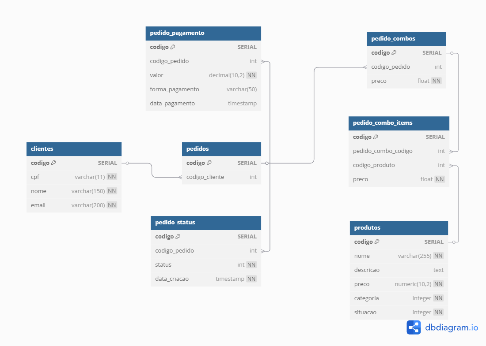

# 9SOAT-G63-MC-KING
## Tech Challenge FIAP - 9SOAT - Grupo 63

## Pipeline Status

[](https://github.com/renaneustaquio/FiapTech-Challenge-Fiap-mcking-liquibase-Fase3/actions/workflows/liquibase.yml)

### Participantes:
- **Mayara Manzi** - RM359734 

mayaramanzi@hotmail.com

- **Renan Eustaquio Claudiano Martins** - RM359737

renan.ecm@outlook.com


## Objetivo
Este projeto visa implementar um sistema de autoatendimento para uma lanchonete de bairro que está em expansão devido ao seu grande sucesso. O objetivo é melhorar o atendimento aos clientes e garantir a precisão dos pedidos, minimizando confusões e atrasos.

### Benefícios esperados:
- **Melhorar a eficiência do atendimento:** Reduzir o tempo de espera dos clientes e garantir a precisão dos pedidos.
- **Aumentar a satisfação dos clientes:** Oferecer uma experiência de atendimento moderna e eficiente.

## Entregáveis - Fase 3
Dando continuidade ao desenvolvimento do software para a lanchonete, teremos as seguintes melhorias e alterações:

1. **Implementação de API Gateway e Function Serverless para autenticação via CPF:**
   - Integração ao sistema de autenticação para identificar o cliente.
2. **Implementação de CI/CD segregado por repositórios - executar na seguinte ordem:**
   - 🔗 **[**1 repositório**](https://github.com/renaneustaquio/FiapTech-Challenge-Fiap-terraform-vpc-Fase3)** para infraestrutura VPC via Terraform.
   - 🔗 **[**1 repositório**](https://github.com/renaneustaquio/FiapTech-Challenge-Fiap-terraform-rds-Fase3)** para infraestrutura de banco de dados gerenciáveis via Terraform.
   - 🔗 **[**1 repositório**](https://github.com/renaneustaquio/FiapTech-Challenge-Fiap-terraform-eks-Fase3)** para infraestrutura Kubernetes via Terraform.
   - 🔗 **[**1 repositório**](https://github.com/renaneustaquio/FiapTech-Challenge-Fiap-lambda-Fase3)** para o Lambda.
   - 🔗 **[**1 repositório**](https://github.com/renaneustaquio/FiapTech-Challenge-Fiap-mcking-liquibase-Fase3)** para versionamento do banco com Liquibase.
   - 🔗 **[**1 repositório**](https://github.com/renaneustaquio/FiapTech-Challenge-Fiap-Mc_King-Fase3)** para a aplicação executada no Kubernetes.
3. **Deploy automatizado via Actions:**
   - As branches `master` serão protegidas.
   - Os commits diretos serão bloqueados, exigindo o uso de Pull Requests.
4. **Melhoria da estrutura do banco de dados:**
   - Documentação seguindo padrões de modelagem de dados.
   - Justificativa da escolha do banco de dados.
5. **Uso obrigatório de serviços serverless:**
   - **Functions:** AWS Lambda, Azure Functions ou Google Functions.
   - **Banco de dados gerenciáveis:** AWS RDS, Banco de Dados do Azure ou Cloud SQL no GCP.
   - **Sistema de autenticação:** AWS Cognito, Microsoft AD ou Google Identity Platform.

## Principais Tecnologias Utilizadas
- **Visual Studio 2022**
- **.NET - 8.0**
- **Postgres - 16.4**
- **AWS EKS**
- **AWS RDS**
- **AWS VPC**
- **AWS Secrets Manager**
- **Cognito**
- **Liquibase**

## Guia de Setup - Versionamento de Banco com Liquibase
Este repositório gerencia o versionamento da base de dados da aplicação McKing utilizando Liquibase, com execução via Kubernetes (EKS).

### Pré-requisitos
Para que o Liquibase funcione corretamente, é necessário que os seguintes repositórios de infraestrutura Terraform já estejam aplicados:
- Infraestrutura **VPC**.
- Infraestrutura **Kubernetes (EKS)**.
- Infraestrutura do **banco de dados (RDS)**.

### Executando Liquibase via GitHub Actions
O pipeline executa um Job Kubernetes no EKS que:
- Extrai a URL do banco via AWS Secrets Manager.
- Monta os arquivos changelog via ConfigMap.
- Executa o Liquibase automaticamente.

### Rodando Manualmente com Kubernetes (EKS)

1. **Certifique-se de estar autenticado no cluster do EKS:**
   Atualize o contexto do Kubernetes para acessar o cluster correto:
   ```bash
   aws eks update-kubeconfig --region us-east-1 --name mcking-cluster

2. **Crie o ConfigMap com os arquivos do changelog**

   Os arquivos de changelog (como `db.changelog-master.xml` e `V1__init.sql`) precisam ser transformados em um ConfigMap no Kubernetes. Use os comandos abaixo para criá-lo:

   ```bash
   $changelogMaster = "liquibase/changelog/db.changelog-master.xml"
   $sqlInit = "liquibase/changelog/V1__init.sql"
   kubectl create configmap liquibase-changelog-cm \
   --from-file=$changelogMaster \
   --from-file=$sqlInit \
   --dry-run=client -o yaml | kubectl apply -f -

3. **Aplique a Job manualmente**
  Certifique-se de que você possui um arquivo de configuração YAML para executar o Liquibase como um Job no Kubernetes (como `k8s/liquibase-job.yaml`). Em seguida, aplique esse arquivo:

   ```bash
   kubectl apply -f k8s/liquibase-job.yaml

4. **Aguarde a conclusão da Job**

   Monitore a execução da Job até que ela seja concluída com sucesso. Utilize o comando abaixo para verificar:

   ```bash
   kubectl wait --for=condition=complete job/liquibase-migration --timeout=300s


5. **Visualize os logs**
   Caso queira inspecionar os logs para entender o que ocorreu durante a execução da Job, utilize o comando abaixo para obter o nome do Pod:

   ```bash
   POD_NAME=$(kubectl get pods --selector=job-name=liquibase-migration -o jsonpath='{.items[0].metadata.name}'

Em seguida visualize:

   ```bash
   kubectl logs $POD_NAME


### 🗄️ Diagrama de Estrutura do Banco de Dados

Você pode visualizar o diagrama completo do banco de dados através do link abaixo:

🔗 **[Ver Diagrama no dbdiagram.io](https://dbdiagram.io/d/DataBase-67e0135f75d75cc84421eb57)**

###  Visualização da Estrutura:


